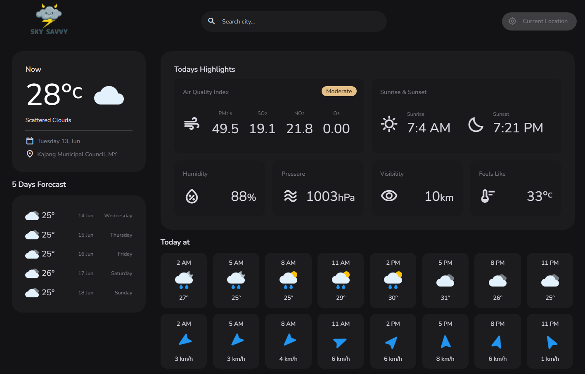

# Project Title

Skysavvy is an innovative weather forecasting website designed to provide users with comprehensive and accurate weather information. With a user-friendly interface and advanced features, Skysavvy aims to deliver a seamless and intuitive experience for individuals seeking up-to-date weather forecasts and related data.

## Tech Stack

**Client:** HTML, CSS, JavaScript, API

## Demo

https://sky-savvy.netlify.app

## Features

- Accurate and up-to-date weather information.
- Interactive and user-friendly interface.
- Additional weather-related content and features.

## Screenshots



## Run Locally

Clone the project

```bash
  git clone https://link-to-project
```

Go to the project directory

```bash
  cd my-project
```

Open with VSCode

```bash
  code .
```

Open with live server

```bash
  npm run start
```


## Authors

- [@naufalfiqri](https://www.linkedin.com/in/naufal-fiqri-0a96151a3/)